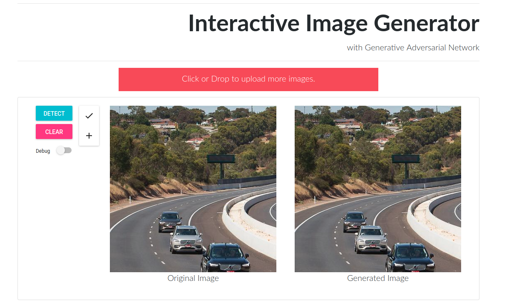

# Interactive Image Generator

Status: ONGOING research project.


-------------------

## Overview

```shell
./
├── app.py  # Flask Applicatiton
├── assets  # Stores trained ML models for inference
├── client  # UI/UX for the app, written using `create-react-app`
└── server  # Python codes for Back-end logics (object detection, image generator, etc.) 
```

## Usage

* Read  [`INSTALLATION.md`.](INSTALLATION.md)
* To run the app, open  2 separate terminals
```python
# Launch back-end server
python app.py
```

```shell
# Launch front-end server
cd client
npm start
```
* You can view the demo at `http://localhost:3000/`

## TODO list
- [ ] Formalize installation process and deploy to production
- [ ] Documentation
- [ ] Fix error handlings bug
- [ ] Update API for Image Generator 
- [ ] Add unit tests, converage tests

## Roadmap
* Integrate GAN model in `server/generator` once it is ready.
* Improve rendering speed in front-end.
* Switch from `HTTP/JSON` to `gRPC`.
* Dockerize the app for cloud deployment.
* Re-written back-end server from python to Go.

## Acknowledgement

 Thank your PhD student Fanyi Xiao and professor Yong J. Lee for providing me resources and support to work on this project.
